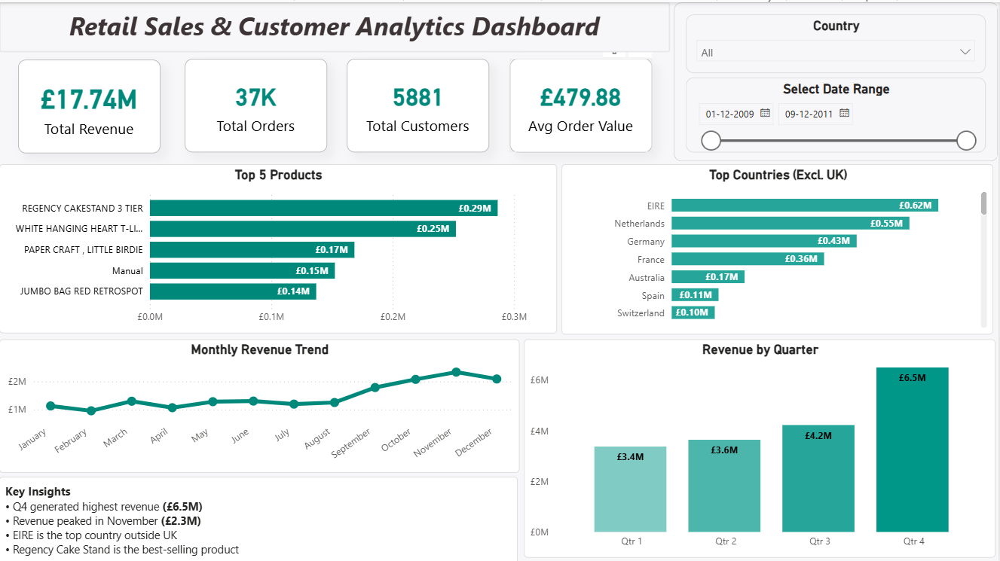

# Retail Sales & Customer Analytics Dashboard

## Project Overview
Developed an interactive Power BI dashboard to analyze retail sales performance, customer purchasing behavior, and key business metrics.

## Dashboard Preview

## Tools Used
- Power BI
- Data Cleaning
- Data Visualization
- Business Analytics

## Key KPIs
- Total Sales
- Total Orders
- Total Customers
- Average Order Value

## Features
- KPI Cards
- Sales Trend Analysis
- Customer Analysis
- Interactive Slicers and Filters

## Author
Tisha Malgundkar
